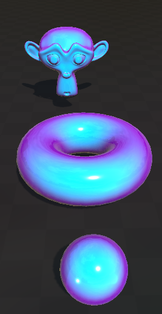
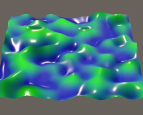
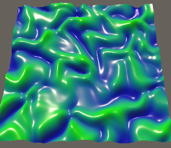
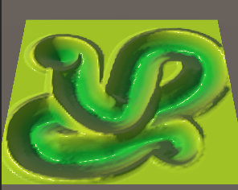
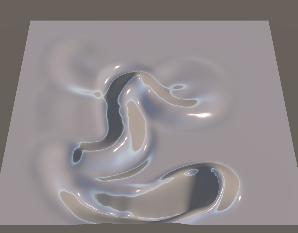
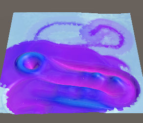

# About

This is a Serhii Ovchynnikov's Solution for the [Test assignment for the Graphics Programmer position at Flexus Games](https://www.linkedin.com/safety/go?url=https%3A%2F%2Fdocs.google.com%2Fdocument%2Fd%2F16AwNgDQ4IvkEv3NseOVaw_c7S689PWGw-1zdWhfzL7U%2Fedit%3Ftab%3Dt.0&trk=flagship-messaging-web&messageThreadUrn=urn%3Ali%3AmessagingThread%3A2-M2FkODE1MDQtNjJhZC00NzAzLTlhYWEtNmEwNTRhODc1N2QwXzEwMA%3D%3D&lipi=urn%3Ali%3Apage%3Ad_flagship3_messaging_conversation_detail%3B2dlFVkQWR%2FuxKamKglXOSA%3D%3D).

# Build and Videos

(**todo**) An .apk build and a video can be found in [Releases](./releases).

# Project Structure

The Project is structured in a Task-oriented way:
- The assets related to every task are placed into respective **Assets/Task{N}** folder
- The shared assets are placed into **Assets/Shared** folder

# Development

You can check the git history to find details about the progress.

# Tasks notes

The tasks 1-4 are implemented very close to the Reference.
The task 5 combines the behaviours of the previous tasks with some creative deviations.
Every task has its own scene, so it can be easily inspectable through the UnityEditor.

The Draw shaders' parameters are controlled from scripts, so changing their values gives no effect.

## Task 1

The reference looks like a standard PBR shader with vieweing-angle-dependent albedo.
So first thing I did was implement the URP PBR analog shader, that supports the standard URP lighting aspects like reflections, GI, shadows.
Next, I added the Fresnel formula and exposed a **_FresnelPow** property, that raised the fresnel value to a specified power.
But after tweaking the Material values I failed to reach the look of the Reference (with the fresnel power one of the Center/Edge colors were not very distinctive), so I changed it to **_FresnelSmoothstep** - it allows to make a more sharp transition between colors and control where the transition actually happens.
This allowed me to reach a look very similar to the Reference and so I accepted it as a final one.

I have left a custom environment cubemap, an additional light and shadowcasting cubes so anyone can play with it and check out the lighting.

## Task 2

The reference looks like some kind of gradient noise (apparently, perlin, based on the description) with some skewing over it that adds wrinkles to it.
Since the main objective is performance and appearance, I made 2 versions:
- (First, top one) The more performant one
- (Second, bottom one) The more beautiful one

### Performance

The performant one does not have skewing - just plain perlin noise. It calculates the height based on this noise and, since calculating perlin noise already includes calculating gradients, the derivative of the perlin noise. This derivative is rotated and used as a normal. So it's cheap computation-wise, it's contiguous because of the use of the analytical derivative and it calculates everything height-normal-related in a vertex shader. But the calculations in the vertex shader make the final result look a bit tiled and not have the interesting skewing.

### Appearance

The beautiful one does have skewing and calculates the normals in the fragment shader. Also, because of the use of multiple noise functions (height + skew), calculating the analytical derivative becomes more complex, so the sampling derivative is used. The sampling derivative requires calculating the noise 3 times in the near points, so it's more computation-heavy. Also, the sampling derivative may introduce sampling artifacts, so the sampling step may need to be adjusted for different scenarios.

## Task 3

The reference looks like just writing to a height map with one pass and then sampling it in another pass as height.
The sampling is simple, it also uses the sampling derivative.
The drawing is more interesting. The task requires having no more than one additional RenderTarget switch. Of course we need to switch render targets to render to a texture instead of a window surface. But I assume it's goal is to limit switching the RenderTexture in the material and other dependent entities. So I decided to not substitute the RenderTexture at all - I can use the Alpha Blending to write to the same destination texture without needing to read the source texture.
This allows me to have only 1 RenderTexture and not having to ping-pong the texture in the materials, scripts and other potential dependent entities (writing the code for handling all the possible dependent entities would be inconvenient in terms of maintenance).
Also, the RenderTexture has an R8_UNORM format. it's 8bit per pixel (256 values representing depth is enough in this case). The height is encoded as black being -1 height and full-red being 1 height, half-valued red represents 0 height.
For this case, where the calues are in [-1; 1] range, using R8 with its constant precision across the values range is just fine.

I played with the paint height function a lot in desmos, but decided to simply use the distance with dynamic falloff.
The waves in fromnt of the draw position are just the result of the alpha circle being offset compared to the height circle. The bigger the offset, the higher the wave and the more the height value is preserved on the paint trail.

## Task 4

The behavior of this task is similar to the previous one, except now there's an additional oscillation stage every frame.
These are 1 stateless and 1 stateful operation, so at least one of them needed the 2 ping-ponging textures setup, so I made it 2 separate pases. It's cleaner that way and avoids updating the texture-depending entities (after each ping-ponging the first RT stays as the active one).
The oscillation is a simple dynamics damped spring equation. It needs both height and velocity states, so both RenderTargets have 2 channels to store them.
Since velocity can exceed the [-1; 1] range, I change the format of the texture to Float16 with RG channels. Now the height and velocity are stored without encoding - pixel values represent the real height and velocity values.

## Task 5

This task is just a combination of the previous ones. The height noise is simple perlin. At its scale and amplitude the skewing would not be very noticeable, so I removed it for the sake of simplicity.
I liked the effect from the Reference, where the untouched parts stayed black and touched parts were colored based on the height. So I added the 3rd state to the RenderTextures - disturbance. The simulation just kept it no lower than the height and make it preserve the state with slight decay.
So the rendering shader colors the surface based on the height and this new disturbance.

I understood the assignment for this task to just combine the previous work into something interesting, so I decided to be creative and add some glitter and frost effect. So the idea is that it's some kind kind of a lake/river near winter. The temperature is just below 0 deg C, so water doesn't freeze quickly and you have this mushy ice impression. So you can disturb the water and it will turn into colorful waves, but then with time it gradually freezes and fills the disturbed area with ice.

So I found some Voronoi noise and started experimenting with it, until I had the visuals I liked.
The ice is just the same surface, but with different smoothness and metallic (to be more reflective, though more matty). And its normals are slightly shifted into random based on the voronoi hash.

Also, I've added some glitter. I wanted the dots to gradually appear and disappear at random positions, but world space noise sampling doesn't provide stable hash results, so random points only appeared for a single frame. I decided to take the pixel screen position, which has stable hash and made it appear and disappear gradually.

The disturbed water is just a gradient of colors. It was an interpolation first, but it didn't look as vibrant as the reference, so I turned it into a function that calculates the hue based on the height and uses it in hsv-to-rgb conversion into the albedo.

## Potential Future Improvements

Some behaviors are not dependent on deltatime, though they better be, because users with different devices/performance settings may see different results. It's better to text with different framerates and add the dt where it needs to be.

Shaders may have had more parameters to be configured better, but it wasn't the assignment - I just played with them until I liked them and kept it this way.

There may be jagged lines visible at some places - the artifacts of sampling. This may be improved with moving computations to fragment shaders, using different functions, storing results into textures/buffers and sampling them with higher-level interpolators, etc.

Most of the code is optimized fine, so I think most wins from the future optimizations are sacrifices to the appearance or maintenance. But they are for sure appropriate for certain use-cases.

The passes in tasks 4-5 could've been a single pass combining drawing and simulating. The non-drawing frames could just give 0-opacity draw request and that would be fine. It's better in terms of performance, but worse in terms of integration with other code. Not bad, just not universal.

The screen-space glitter looks more like a window into space instead of a surface, because ot its screen-space nature. If it would've been required, I'd invest more time in finding a better solution.

At first the drawing behaviors had access to render materials (not only the draw materials like now) and they controlled the TilingOffset of the textures based on where the texture is located (world-to-texture and texture-to-world uv conversions). Now the TilingOffset is there, but is not updated automatically.

The **Graphics.Blit** can be changed into a render feature to be more inline with the Unity render architecture and RenderGraph. I didn't do it here, because this is just a demonstration of shaders, not their integration into the game.

The half/float precision is not consistent in the code. I mostly used half where applicable, but there are some places where the 32-bit float is redundant.